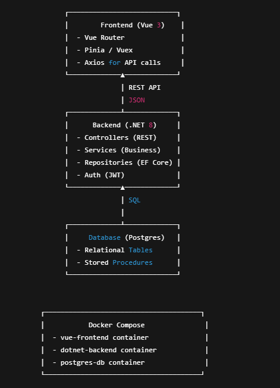

# 💼 Richard's Portfolio

This repository is a **technical portfolio** prepared for the *Senior Fullstack .NET Developer* role.  
It contains **code samples, architecture diagrams, case studies, and documentation** that showcase my experience in backend, frontend, and fullstack development.

---

## 📌 About this Portfolio
This repository demonstrates my ability to design and deliver **modern, scalable applications** using:

- **Backend:** .NET 8 (C#), Entity Framework Core, PostgreSQL  
- **Frontend:** Vue 3, TypeScript  
- **Containerization:** Docker & Docker Compose  
- **Testing:** xUnit  
- **Version Control:** Git & GitHub  
- **Architecture & Documentation:** Diagrams, case studies, coding guidelines  

---

## 🖥️ Tech Stack
- **.NET 8 / C#**  
- **Vue 3 + Vite + TypeScript**  
- **PostgreSQL**  
- **Docker / Docker Compose**  
- **Entity Framework Core**  
- **xUnit** for automated tests  

---

## 📂 Repository Structure

richard-portfolio/
│── backend-dotnet-postgres/ # API with .NET + PostgreSQL
│ ├── src/
│ ├── tests/
│ └── README.md
│
│── frontend-vue-demo/ # Vue 3 demo application
│ ├── src/
│ └── README.md
│
│── fullstack-dockerized/ # Docker Compose setup for fullstack demo
│ ├── docker-compose.yml
│ └── README.md
│
│── docs/ # Documentation & case studies
│ ├── architecture-diagram.png
│ ├── case-study-erp.pdf
│ └── coding-guidelines.md
│
└── README.md # You are here

---

## ⚡ Key Features
- ✅ Backend REST API with CRUD endpoints (C# / .NET 8 / EF Core / PostgreSQL)  
- ✅ Frontend Vue 3 application consuming the API  
- ✅ Dockerized environment for easy deployment  
- ✅ Unit tests with xUnit  
- ✅ Documentation and architecture diagrams  

---

## 📊 Architecture Overview


---

## 📖 Case Study
See [case-study-erp.pdf](docs/case-study-erp.pdf) for a **real-world project** explanation:  
- **Problem:** Legacy ERP system with limited scalability.  
- **Solution:** Migration to a modular architecture using .NET APIs and Vue SPA.  
- **Result:** Improved performance, maintainability, and scalability.  

---

## 🧪 Testing
- Backend unit tests with **xUnit** are available under `backend-dotnet-postgres/tests/`.  
- Example: Repository pattern tests, service layer validations, and API integration tests.  

---

## 🚀 How to Run Locally
```bash
# 1. Clone the repository
git clone https://github.com/<your-github-username>/richard-portfolio.git

# 2. Navigate to the dockerized setup
cd richard-portfolio/fullstack-dockerized

# 3. Start the stack
docker-compose up --build

# 4. Access the applications
# API: http://localhost:5000
# Frontend: http://localhost:8080
